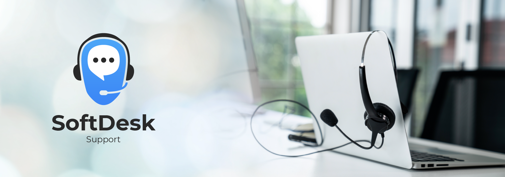

# SoftDesk Support


[](https://www.python.org/dev/peps/pep-0008/)
[](https://flake8.pycqa.org/en/latest/)
[](https://github.com/psf/black)
[](https://(https://github.com/rtts/djhtml))


SoftDesk, une société d'édition de logiciels de collaboration, a décidé de publier une application permettant de remonter et suivre des problèmes techniques. Cette solution, SoftDesk Support, s’adresse à des entreprises en B2B (Business to Business). 

Développement d'une API RESTful

## Documents du Projet


1. __[Conception de la mise en œuvre](docs/Softdesk+-+Conception+de+la+mise+en+œuvre.pdf)__

    Contenant :
    * les modèles d'objets ; 
    * les principales fonctionnalités de l’application ; 
    * une liste des points de terminaison d'API requis et un exemple de réponse. 

2. __[Exigences de sécurité et d'optimisation](docs/Softdesk+-+Exigences+de+sécurité+et+d'optimisation.pdf)__

    Contenant :
    * Les spécifications OWASP répertorient les mesures de sécurité OWASP que le back-end doit respecter. L’API devra authentifier les utilisateurs à l’aide de Json Web Token (JWT) et définir des permissions d’accès aux ressources par groupe d’utilisateurs ;
    * Les spécifications RGPD appliquent les règles de protection de la donnée et la confidentialité de chaque utilisateur. L’API devra s’assurer que les utilisateurs puissent protéger leurs données et spécifier s’ils souhaitent ou non être contactés via un champ de formulaire spécifique ;
    * Les spécifications green code répertorient les mesures de conceptions « green », qui permettent d’optimiser et de simplifier le code, dans un but de sobriété énergétique. L’API devra tendre vers une utilisation optimisée des requêtes pour éviter la surconsommation des serveurs.


## Installation et activation de l'environnement Virtuel
Ouvrez un nouveau terminal et taper : 
```bash
python -m venv .env-projet10-softdesk
```
Selectionner l'environnement virtuel dans visual studio code ou l'activer en se plaçant dans le dossier **.env-projet10-softdesk/scripts** et taper : 
```bash
./activate
```
Installer les dependances necessaires au projet : 
```bash
pip install -r requirements.txt
```
## Usage


## Contribuer

Si vous souhaitez contribuer à ce projet, veuillez suivre ces étapes :

    Ouvrez un problème pour discuter de ce que vous souhaitez changer.
    Fork ce dépôt et créez une branche pour votre contribution.
    Soumettez une demande d'extraction avec vos modifications.
